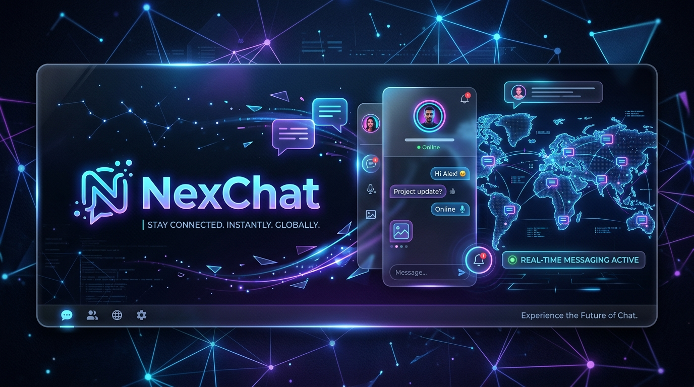

# 🚀 NexChat - Next Generation Real-Time Communication Platform

<div align="center">
  
</div>

## 🌟 Overview

**NexChat** is a highly scalable, full-stack real-time communication platform built to emulate the smooth, responsive experience of modern chat applications like WhatsApp and Telegram. 

Designed with distributed systems in mind, NexChat leverages the power of WebSockets, Redis Streams, and Machine Learning to deliver a rich, low-latency messaging experience, complete with AI-powered sentiment analysis and spam detection.

---

## ✨ Features

- **💬 Real-Time Messaging:** Instantaneous direct and group chat using STOMP WebSockets.
- **🎥 WebRTC Video/Audio Calling:** Seamless peer-to-peer secure calls with in-house signaling.
- **🤖 AI-Powered Analysis:** Real-time sentiment analysis and spam scoring powered by an asynchronous Python ML Service.
- **📁 Robust Media Sharing:** Image, video, and audio attachments with MinIO object storage (and local disk fallback).
- **👍 Interactive Chats:** Message reactions (emojis), read receipts, and real-time typing indicators.
- **🎨 Premium UI/UX:** Responsive, modern interface with a flawless Dark/Light mode engine.
- **🔒 Secure Architecture:** Stateless JWT authentication, Spring Security, and BCrypt password hashing.
- **⚡ Distributed Ready:** Redis Pub/Sub integration for horizontal scalability and cross-node broadcasting.

---

## 🛠️ Technology Stack

### **Frontend (Client)**
- **Framework:** React 18 with TypeScript & Vite
- **Styling:** Vanilla CSS (CSS Variables for dynamic theming)
- **Networking:** Axios, native `fetch` API, and `@stomp/stompjs`
- **Routing:** React Router DOM

### **Backend (Core Server)**
- **Framework:** Spring Boot 3 (Java 17)
- **Data Access:** Spring Data JPA (Hibernate)
- **Database:** PostgreSQL (or H2 for local testing)
- **Messaging:** Spring WebSockets, Redis Streams
- **Storage:** MinIO Client
- **Security:** Spring Security, JWT

### **ML-Service (AI Analysis)**
- **Framework:** FastAPI (Python)
- **NLP Engine:** TextBlob
- **Integration:** Redis `redis.asyncio` for high-throughput stream processing

---

## 🚀 Getting Started

Follow these steps to get a copy of the project up and running on your local machine for development and testing purposes.

### 1️⃣ Prerequisites
Ensure you have the following installed:
- [Node.js](https://nodejs.org/) (v18+)
- [Java Development Kit (JDK)](https://adoptium.net/) (v17+)
- [Python](https://www.python.org/) (v3.9+)
- [Redis](https://redis.io/) (Running on `localhost:6379`)

### 2️⃣ Clone the Repository
```bash
git clone https://github.com/yourusername/NexChat.git
cd NexChat
```

### 3️⃣ Start the Backend (Spring Boot)
Open a terminal and navigate to the `backend` directory:
```bash
cd backend
# On Windows
.\mvnw.cmd spring-boot:run
# On Mac/Linux
./mvnw spring-boot:run
```
*The backend will be available at `http://localhost:8080`*

### 4️⃣ Start the ML Service (FastAPI)
Open a new terminal and navigate to the `ml-service` directory:
```bash
cd ml-service
pip install -r requirements.txt
uvicorn main:app --host 0.0.0.0 --port 8000
```
*The ML Service runs in the background analyzing Redis streams.*

### 5️⃣ Start the Frontend (Vite)
Open a new terminal and navigate to the `frontend` directory:
```bash
cd frontend
npm install
npm run dev
```
*The frontend will launch at `http://localhost:5173`. Open this URL in your browser to start chatting!*

---

## 🤝 Contributing

We welcome contributions from the community! Whether it's a bug fix, new feature, or documentation improvement, we'd love to see your pull requests.

### How to Contribute
1. **Fork the repository** to your own GitHub account.
2. **Create a new branch** for your feature or bug fix:
   ```bash
   git checkout -b feature/AmazingFeature
   ```
3. **Commit your changes**:
   ```bash
   git commit -m "Add some AmazingFeature"
   ```
4. **Push to the branch**:
   ```bash
   git push origin feature/AmazingFeature
   ```
5. **Open a Pull Request** against the `main` branch of this repository.

### Coding Guidelines
- Please write clean, self-documenting code.
- Ensure your changes do not break existing backend tests.
- Format frontend code using Prettier before committing.

---

## 📄 License

This project is licensed under the MIT License - see the [LICENSE](LICENSE) file for details.

---

<div align="center">
  <b>Built with ❤️ by the NexChat Community</b>
</div>
